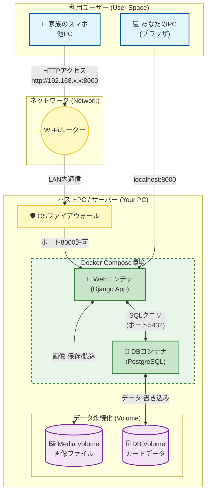

# アーキテクチャ設計

## 1\. システムアーキテクチャ図

家庭内LANを経由して、Dockerコンテナ内のDjangoアプリへアクセスする経路と、データの永続化（保存）の流れを示しています。

### 図のポイント

1. **外部からの入り口**: 家族のスマホからはWi-Fiルーターを経由し、あなたのPCのIPアドレス（例: 192.168.x.x）を叩くことでWebコンテナに到達します。
2. **データ永続化**: コンテナを削除してもデータが消えないよう、右下の「Volume」部分でホストPC（あなたのPC）のフォルダと同期させます。
3. **コンテナ間通信**: WebコンテナとDBコンテナはDocker内部のネットワークで直接通信します（外部には露出しません）。

-----

## 2\. 技術スタック一覧

今回の開発で使用する技術と、開発・運用において「何を知っておくべきか（学習・準備ポイント）」をまとめました。

| カテゴリ | 技術・ツール | バージョン (目安) | 用途 | 準備・学習ポイント |
| :--- | :--- | :--- | :--- | :--- |
| **インフラ** | **Docker / Compose** | - | アプリとDBの実行環境構築 | ・`docker-compose.yml` の基本構文 ・Volume（データ永続化）の仕組み ・ポートフォワーディングの設定 |
| **言語** | **Python** | 3.11系 | バックエンド処理全般 | ・基本的な構文 (リスト内包表記など) ・仮想環境 (venv) の概念 ※Docker内では不要だが知識として |
| **フレームワーク** | **Django** | 5.0系 | Webアプリの骨格、管理画面 | ・**Model (DB定義)** の書き方 ・**Admin (管理画面)** のカスタマイズ方法 ・Template (HTML) タグの使い方 |
| **データベース** | **PostgreSQL** | 16系 | データの保存 | ・基本的にはDjangoが隠蔽するため深い知識は不要 ・`pg_dump` などのバックアップ方法 (将来用) |
| **フロントエンド** | **Bootstrap** | 5.3 | 画面デザイン (CSS) | ・グリッドシステム (スマホ/PCの表示切替) ・主要クラス (`btn`, `card`, `form-control` 等) の使い方 |
| **ライブラリ** | **django-import-export** | 最新 | CSVの入出力機能 | ・管理画面への組み込み方 ・Resourceクラスの定義方法 |
| **ライブラリ** | **django-filter** | 最新 | 検索・絞り込み機能 | ・FilterSetクラスの定義方法 ・HTML側でのフォーム表示方法 |
| **ライブラリ** | **Pillow** | 最新 | 画像処理 | ・Djangoで画像 (`ImageField`) を扱うために必須 ・特別な学習は不要 (インストールのみ) |
