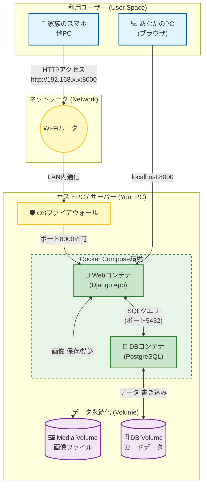

# アーキテクチャ設計

## 1\. 技術スタック一覧

今回の開発で使用している技術をまとめました。

| カテゴリ                | 技術・ツール                 | バージョン (目安) | 用途                       | 準備・必要な知見                                                  |
| :---------------------- | :--------------------------- | :---------------- | :------------------------- | :---------------------------------------------------------------- |
| **インフラ**            | **Docker / Compose**         | -                 | アプリとDBの実行環境構築   | ・`docker-compose.yml` ・Volume（データ永続化）・ポート設定       |
| **パッケージ管理**      | **Poetry**                   | -                 | 依存ライブラリの管理       | ・`pyproject.toml` ・`poetry install/add` の使い方                |
| **言語**                | **Python**                   | 3.11系            | バックエンド処理全般       | ・基本構文 ・型ヒント                                             |
| **フレームワーク**      | **Django**                   | 5.0系             | Webアプリの骨格、管理画面  | ・Model/Admin設計 ・Templateタグ ・URL設計                        |
| **データベース**        | **PostgreSQL**               | 16系              | データの保存               | ・永続化の仕組み（Volume同期）                                    |
| **フロントエンド(CSS)** | **Tailwind CSS / DaisyUI**   | 3.x / 4.x         | モダンなUIデザイン         | ・Utilityクラスでのスタイリング ・DaisyUIのテーマ・コンポーネント |
| **フロントエンド(JS)**  | **HTMX**                     | 2.x               | 動的なUX（非同期更新）     | ・`hx-` 属性による部分更新 ・Ajaxを使わないスマートな画面遷移     |
| **AI (画像解析)**       | **YOLO-World (Ultralytics)** | v8s-worldv2       | 写真からのカード自動検出   | ・物体検知の概念 ・検出結果（バウンディングボックス）の扱い       |
| **AI (LLM分析)**        | **Google Gemini API**        | 2.0-flash等       | カード情報の抽出・属性解析 | ・プロンプトエンジニアリング ・JSON形式でのレスポンス処理         |
| **ライブラリ**          | **django-import-export**     | 最新              | CSVの入出力機能            | ・Resourceクラスの定義方法                                        |
| **ライブラリ**          | **django-filter**            | 最新              | 高度な検索・絞り込み       | ・FilterSetクラスの定義 ・Widgetのカスタマイズ                    |
| **ライブラリ**          | **Pillow / OpenCV**          | 最新              | 画像の加工・クロップ       | ・`ImageField` ・画像のリサイズ、グリッド生成、クロップ処理       |
| **ライブラリ**          | **django-cleanup**           | 最新              | ストレージ最適化           | ・レコード削除時の画像ファイル自動削除                            |

-----

## 2\. システムアーキテクチャ図

### Step1\. 家庭内利用　ローカルPCデプロイ版

家庭内LANを経由して、Dockerコンテナ内のDjangoアプリへアクセスする経路と、データの永続化（保存）の流れを示しています。

#### 主要ポイント

1. **外部からの入り口**: 家族のスマホからはWi-Fiルーターを経由し、あなたのPCのIPアドレス（例: 192.168.x.x）を叩くことでWebコンテナに到達します。
2. **データ永続化**: コンテナを削除してもデータが消えないよう、右下の「Volume」部分でホストPC（あなたのPC）のフォルダと同期させます。
3. **コンテナ間通信**: WebコンテナとDBコンテナはDocker内部のネットワークで直接通信します（外部には露出しません）。
