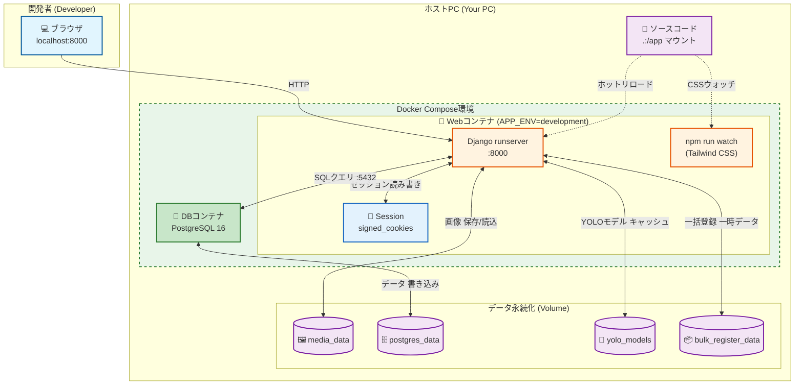
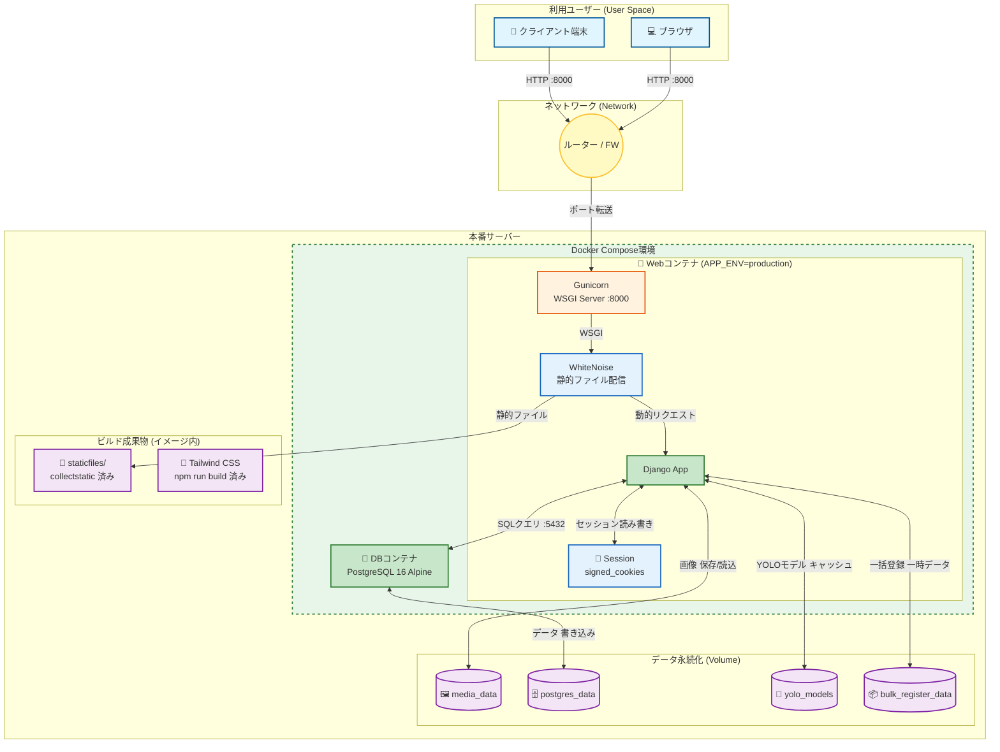
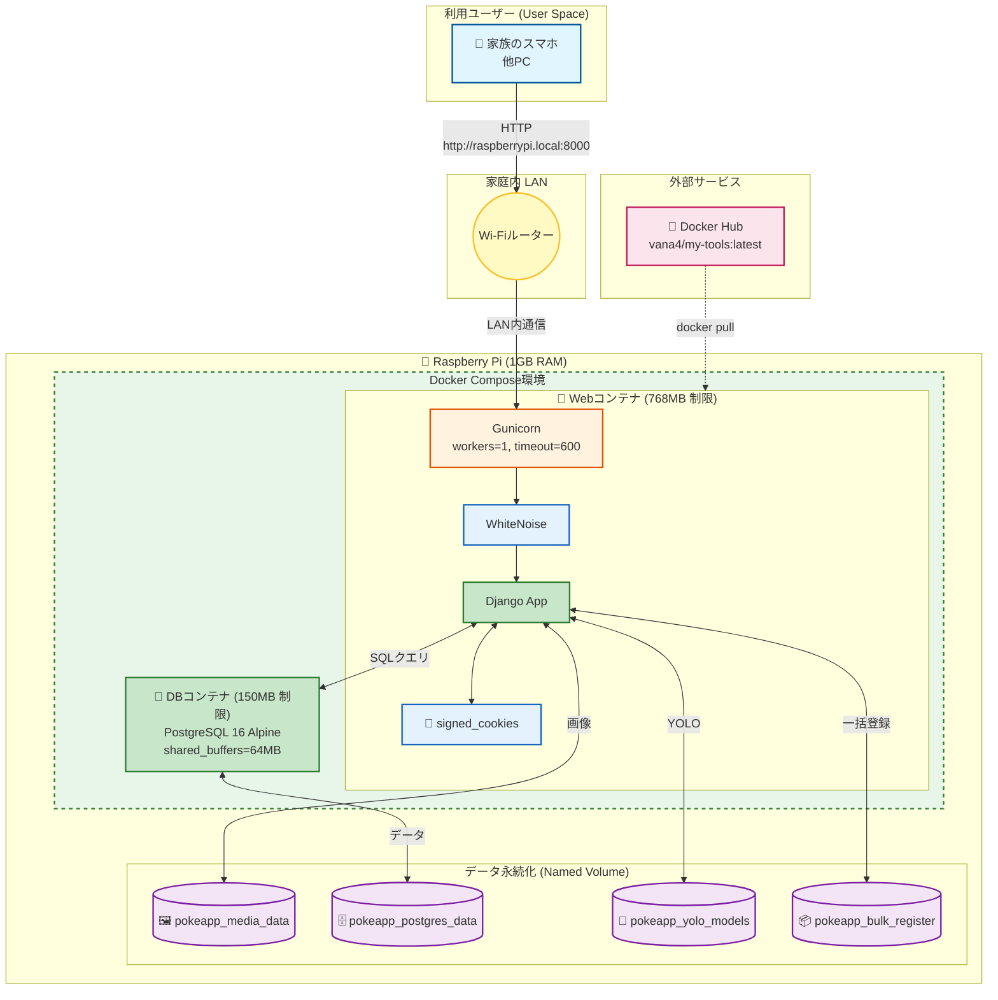

# アーキテクチャ設計

## 1\. 技術スタック一覧

今回の開発で使用している技術をまとめました。

| カテゴリ                | 技術・ツール                 | バージョン (目安) | 用途                         | 準備・必要な知見                                                       |
| :---------------------- | :--------------------------- | :---------------- | :--------------------------- | :--------------------------------------------------------------------- |
| **インフラ**            | **Docker / Compose**         | -                 | アプリとDBの実行環境構築     | ・`docker-compose.yml` ・Volume（データ永続化）・ポート設定            |
| **パッケージ管理**      | **Poetry**                   | -                 | 依存ライブラリの管理         | ・`pyproject.toml` ・`poetry install/add` の使い方                     |
| **言語**                | **Python**                   | 3.11系            | バックエンド処理全般         | ・基本構文 ・型ヒント                                                  |
| **フレームワーク**      | **Django**                   | 5.0系             | Webアプリの骨格、管理画面    | ・Model/Admin設計 ・Templateタグ ・URL設計                             |
| **データベース**        | **PostgreSQL**               | 16系              | データの保存                 | ・永続化の仕組み（Volume同期）                                         |
| **本番サーバー**        | **Gunicorn**                 | 最新              | WSGIアプリケーションサーバー | ・`entrypoint.sh` での起動 ・ワーカー数/タイムアウト設定               |
| **静的ファイル配信**    | **WhiteNoise**               | 最新              | 本番環境での静的ファイル配信 | ・Nginx不要のシンプル構成 ・圧縮/キャッシュ対応                        |
| **ビルドツール**        | **Node.js / npm**            | 20系              | Tailwind CSSのビルド         | ・`npm run watch` (dev) ・`npm run build` (prd) ・マルチステージビルド |
| **フロントエンド(CSS)** | **Tailwind CSS / DaisyUI**   | 3.x / 4.x         | モダンなUIデザイン           | ・Utilityクラスでのスタイリング ・DaisyUIのテーマ・コンポーネント      |
| **フロントエンド(JS)**  | **HTMX**                     | 2.x               | 動的なUX（非同期更新）       | ・`hx-` 属性による部分更新 ・Ajaxを使わないスマートな画面遷移          |
| **AI (画像解析)**       | **YOLO-World (Ultralytics)** | v8s-worldv2       | 写真からのカード自動検出     | ・物体検知の概念 ・検出結果（バウンディングボックス）の扱い            |
| **AI (LLM分析)**        | **Google Gemini API**        | 2.0-flash等       | カード情報の抽出・属性解析   | ・プロンプトエンジニアリング ・JSON形式でのレスポンス処理              |
| **ライブラリ**          | **django-import-export**     | 最新              | CSVの入出力機能              | ・Resourceクラスの定義方法                                             |
| **ライブラリ**          | **django-filter**            | 最新              | 高度な検索・絞り込み         | ・FilterSetクラスの定義 ・Widgetのカスタマイズ                         |
| **ライブラリ**          | **Pillow / OpenCV**          | 最新              | 画像の加工・クロップ         | ・`ImageField` ・画像のリサイズ、グリッド生成、クロップ処理            |
| **ライブラリ**          | **django-cleanup**           | 最新              | ストレージ最適化             | ・レコード削除時の画像ファイル自動削除                                 |

-----

## 2\. システムアーキテクチャ図

本アプリケーションは、**3つの環境**で動作するよう設計されています。

| 環境      | 用途                | 利用ファイル                                                    | 起動コマンド                                                         |
| :-------- | :------------------ | :-------------------------------------------------------------- | :------------------------------------------------------------------- |
| **dev**   | ローカルPC開発      | `docker-compose.yml` + `docker-compose.override.yml` (自動適用) | `docker compose up`                                                  |
| **prd**   | 本番デプロイ (汎用) | `docker-compose.yml` + `docker-compose.prod.yml`                | `docker compose -f docker-compose.yml -f docker-compose.prod.yml up` |
| **raspi** | Raspberry Pi 最適化 | `docker-compose.raspi.yml`                                      | `docker compose -f docker-compose.raspi.yml up`                      |

### 環境別構成比較

| コンポーネント       | dev                              | prd                      | raspi                    |
| :------------------- | :------------------------------- | :----------------------- | :----------------------- |
| **Webサーバー**      | Django runserver                 | Gunicorn                 | Gunicorn                 |
| **静的ファイル配信** | Django 開発サーバー              | WhiteNoise               | WhiteNoise               |
| **CSSビルド**        | `npm run watch` (ホットリロード) | ビルド済み (Dockerfile)  | ビルド済み (Docker Hub)  |
| **セッション管理**   | signed_cookies                   | signed_cookies           | signed_cookies           |
| **DBイメージ**       | postgres:16                      | postgres:16-alpine       | postgres:16-alpine       |
| **メモリ制限**       | なし                             | 500MB (web) / 100MB (db) | 768MB (web) / 150MB (db) |
| **イメージソース**   | ローカルビルド                   | ローカルビルド           | Docker Hub Pull          |

> **⚠️ 見えづらい機能について**
>
> - 上記表には Django のデフォルト機能や暗黙的に有効化される機能が含まれます。
>
> | 機能 | 説明 |
> | :--- | :--- |
> | **セッション管理 (signed_cookies)** | Django のデフォルトは `db` バックエンドですが、本アプリでは `settings.py` で `signed_cookies` に変更しています。アーキテクチャ図では Cookie アイコン (🍪) で表現されています。 |
> | **静的ファイル配信 (dev)** | Django 開発サーバー (`runserver`) は `DEBUG=True` 時に自動で静的ファイルを配信します。明示的な設定は不要です。 |
> | **CSRF保護** | Django のミドルウェアにより全環境で自動的に有効です。 |
>
> - 環境変数 `SESSION_ENGINE` でセッションバックエンドをオーバーライド可能です。

---

### 2.1. 開発環境 (dev)

ローカルPCでの開発時の構成です。ソースコードのホットリロードと Tailwind CSS のウォッチャーが有効になります。

#### dev環境の特徴

1. **ホットリロード**: `.:/app` のボリュームマウントにより、ソースコード変更が即座に反映されます。
2. **Tailwind CSS ウォッチャー**: `npm run watch` がバックグラウンドで動作し、CSSの変更を自動ビルドします。
3. **Django 開発サーバー**: `python manage.py runserver` による静的ファイル配信とデバッグ機能が有効です。

---

### 2.2. 本番環境 (prd)

汎用的な本番デプロイの構成です。Gunicorn と WhiteNoise により、本番グレードのパフォーマンスを実現します。

#### prd環境の特徴

1. **Gunicorn (WSGI Server)**: 本番向けのマルチプロセスHTTPサーバー。`entrypoint.sh` で起動されます。
2. **WhiteNoise**: Nginx なしで静的ファイルを効率的に配信するミドルウェア。圧縮・キャッシュ対応。
3. **マルチステージビルド**: Dockerfile でNode.js (Tailwind) ビルドを分離し、最終イメージを軽量化。
4. **signed_cookies セッション**: DBやキャッシュへの追加接続不要。Cookie に署名付きでセッションデータを格納。
5. **メモリ制限**: `deploy.resources.limits` でコンテナごとのメモリ使用量を制限。

---

### 2.3. Raspberry Pi 環境 (raspi)

1GB RAM の Raspberry Pi 向けに最適化された構成です。Docker Hub からビルド済みイメージを Pull して使用します。

#### raspi環境の特徴

1. **Docker Hub からの Pull**: ローカルビルド不要。`vana4/my-tools:latest` からイメージを取得。
2. **メモリ最適化**:
   - Web: 768MB 制限, Gunicorn ワーカー数 1
   - DB: 150MB 制限, `shared_buffers=64MB`, `max_connections=20`
3. **長いタイムアウト**: `GUNICORN_TIMEOUT=600` でPyTorch/YOLOの初期化時間を考慮。
4. **ヘルスチェック**: `start_period=120s` でAI初期化完了を待機。
5. **Named Volume**: `pokeapp_*` プレフィックスで他アプリとの名前衝突を回避。
