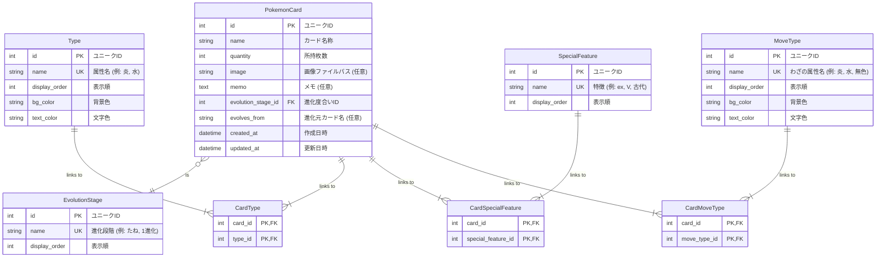

# ER図

## 概要

このドキュメントは、ポケモンカード管理アプリケーションのデータベース設計をER図 (Entity-Relationship Diagram) で示します。
ダイアグラムはMermaid形式で記述されています。

## テーブル一覧

| No | テーブル名 | テーブル概要 |
|---|---|---|
| 1 | PokemonCard | ポケモンカードの基本情報を管理するメインテーブル。カード名称、所持枚数、画像、メモ、進化元カード名などを保持 |
| 2 | Type | カードのタイプ（炎、水、草など）を管理するマスタテーブル。表示順と色情報（背景色・文字色）を保持 |
| 3 | EvolutionStage | カードの進化段階（たね、1進化、2進化など）を管理するマスタテーブル。表示順を保持 |
| 4 | SpecialFeature | カードの特別な特徴（ex、V、VSTAR、古代など）を管理するマスタテーブル。表示順を保持 |
| 5 | MoveType | カードのわざに必要なエネルギータイプ（炎、水、無色など）を管理するマスタテーブル。表示順と色情報（背景色・文字色）を保持 |
| 6 | CardType | PokemonCardとTypeの多対多リレーションを表現する中間テーブル。1枚のカードが複数のタイプを持つことを可能にする |
| 7 | CardSpecialFeature | PokemonCardとSpecialFeatureの多対多リレーションを表現する中間テーブル。1枚のカードが複数の特別な特徴を持つことを可能にする |
| 8 | CardMoveType | PokemonCardとMoveTypeの多対多リレーションを表現する中間テーブル。1枚のカードのわざが複数のエネルギータイプを必要とすることを可能にする |

## ER Diagram

## データモデルのポイント

- **カード本体 (`PokemonCard`)**: カードの基本情報（名称、枚数など）と、他のマスタへの参照を持ちます。
- **マスタデータ**:
  - `Type` (タイプ: 炎, 水など)
  - `EvolutionStage` (進化度合い: たね, 1進化など)
  - `SpecialFeature` (特徴: ex, Vなど)
  - `MoveType` (わざの属性: 炎, 水など)
  これらをマスタ化することで、選択肢の一貫性を保ち、将来的な追加・変更を容易にします。
- **多対多の関係**:
  - カードの「タイプ」「特徴」「わざの属性」は複数持つ可能性があるため、それぞれ中間テーブル (`CardType`, `CardSpecialFeature`, `CardMoveType`) を用いて表現します。
