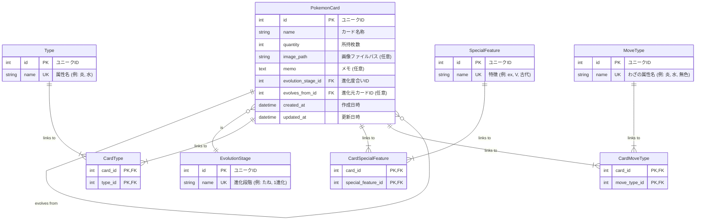

# ER図

## 概要

このドキュメントは、ポケモンカード管理アプリケーションのデータベース設計をER図 (Entity-Relationship Diagram) で示します。
ダイアグラムはMermaid形式で記述されています。

## データモデルのポイント

- **カード本体 (`PokemonCard`)**: カードの基本情報（名称、枚数など）と、他のマスタへの参照を持ちます。
- **マスタデータ**:
  - `Type` (タイプ: 炎, 水など)
  - `EvolutionStage` (進化度合い: たね, 1進化など)
  - `SpecialFeature` (特徴: ex, Vなど)
  - `MoveType` (わざの属性: 炎, 水など)
  これらをマスタ化することで、選択肢の一貫性を保ち、将来的な追加・変更を容易にします。
- **多対多の関係**:
  - カードの「タイプ」「特徴」「わざの属性」は複数持つ可能性があるため、それぞれ中間テーブル (`CardType`, `CardSpecialFeature`, `CardMoveType`) を用いて表現します。
- **自己参照**:
  - カードの進化ライン（例: フシギダネ → フシギソウ）は、`PokemonCard` テーブル内の自己参照 `evolves_from_id` によって表現します。

## ER Diagram

