# ER図

## 概要

このドキュメントは、ポケモンカード管理アプリケーションのデータベース設計をER図 (Entity-Relationship Diagram) で示します。
ダイアグラムはMermaid形式で記述されています。

## テーブル一覧

| No | テーブル名 | テーブル概要 |
|---|---|---|
| 1 | PokemonCard | ポケモンカードの基本情報を管理するメインテーブル。カード名称、所持枚数、画像、メモ、進化元カード名、カテゴリなどを保持 |
| 2 | CardCategory | カードの大分類（ポケモン/トレーナーズ）を管理するマスタテーブル。表示順を保持 |
| 3 | Type | カードのタイプ（炎、水、草など）を管理するマスタテーブル。表示順と色情報（背景色・文字色）を保持 |
| 4 | EvolutionStage | カードの進化段階（たね、1進化、2進化など）を管理するマスタテーブル。表示順を保持 |
| 5 | SpecialFeature | カードの特別な特徴（ex、V、VSTAR、古代など）を管理するマスタテーブル。表示順を保持 |
| 6 | MoveType | カードのわざに必要なエネルギータイプ（炎、水、無色など）を管理するマスタテーブル。表示順と色情報（背景色・文字色）を保持 |
| 7 | TrainerType | トレーナーズカードの種別（道具、サポート、スタジアムなど）を管理するマスタテーブル。表示順を保持 |
| 8 | SpecialTrainer | カードのレアリティ（ACE、通常など）を管理するマスタテーブル。表示順を保持。将来的な拡張を見越してマスタ化 |
| 9 | CardType | PokemonCardとTypeの多対多リレーションを表現する中間テーブル。1枚のカードが複数のタイプを持つことを可能にする |
| 10 | CardSpecialFeature | PokemonCardとSpecialFeatureの多対多リレーションを表現する中間テーブル。1枚のカードが複数の特別な特徴を持つことを可能にする |
| 11 | CardMoveType | PokemonCardとMoveTypeの多対多リレーションを表現する中間テーブル。1枚のカードのわざが複数のエネルギータイプを必要とすることを可能にする |
| 12 | SpecialTrainer_Cards | PokemonCardとSpecialTrainerの多対多リレーションを表現する中間テーブル。1枚のカードが複数のレアリティを持つことを可能にする |

## ER Diagram

```mermaid
erDiagram
    PokemonCard {
        int id PK "ユニークID"
        string name "カード名称"
        int quantity "所持枚数"
        string image "画像ファイルパス (任意)"
        text memo "メモ (任意)"
        int category_id FK "カテゴリID (ポケモン/トレーナーズ)"
        int evolution_stage_id FK "進化度合いID (ポケモンのみ、任意)"
        string evolves_from "進化元カード名 (ポケモンのみ、任意)"
        int trainer_type_id FK "トレーナーズ種別ID (トレーナーズのみ、任意)"
        datetime created_at "作成日時"
        datetime updated_at "更新日時"
    }

    CardCategory {
        int id PK "ユニークID"
        string name UK "カテゴリ名 (例: ポケモン, トレーナーズ)"
        string slug UK "URL用スラッグ (例: pokemon, trainers)"
        int display_order "表示順"
        string bg_color "背景色"
        string text_color "文字色"
    }

    Type {
        int id PK "ユニークID"
        string name UK "属性名 (例: 炎, 水)"
        int display_order "表示順"
        string bg_color "背景色"
        string text_color "文字色"
    }

    EvolutionStage {
        int id PK "ユニークID"
        string name UK "進化段階 (例: たね, 1進化)"
        int display_order "表示順"
    }

    SpecialFeature {
        int id PK "ユニークID"
        string name UK "特徴 (例: ex, V, 古代)"
        int display_order "表示順"
    }

    MoveType {
        int id PK "ユニークID"
        string name UK "わざの属性名 (例: 炎, 水, 無色)"
        int display_order "表示順"
        string bg_color "背景色"
        string text_color "文字色"
    }

    TrainerType {
        int id PK "ユニークID"
        string name UK "トレーナーズ種別 (例: 道具, サポート, スタジアム)"
        int display_order "表示順"
    }

    SpecialTrainer {
        int id PK "ユニークID"
        string name UK "レアリティ名 (例: ACE, 通常)"
        int display_order "表示順"
        string bg_color "背景色"
        string text_color "文字色"
    }

    CardType {
        int card_id PK, FK
        int type_id PK, FK
    }

    CardSpecialFeature {
        int card_id PK, FK
        int special_feature_id PK, FK
    }

    CardMoveType {
        int card_id PK, FK
        int move_type_id PK, FK
    }

    SpecialTrainer_Cards {
        int card_id PK, FK
        int special_trainer_id PK, FK
    }

    PokemonCard }o--|| CardCategory : "belongs to"
    PokemonCard }o--o| EvolutionStage : "has (optional)"
    PokemonCard }o--o| TrainerType : "has (optional)"

    PokemonCard ||--|{ CardType : "links to"
    Type ||--|{ CardType : "links to"

    PokemonCard ||--|{ CardSpecialFeature : "links to"
    SpecialFeature ||--|{ CardSpecialFeature : "links to"

    PokemonCard ||--|{ CardMoveType : "links to"
    MoveType ||--|{ CardMoveType : "links to"

    PokemonCard ||--|{ SpecialTrainer_Cards : "links to"
    SpecialTrainer ||--|{ SpecialTrainer_Cards : "links to"

```

## データモデルのポイント

- **カード本体 (`PokemonCard`)**: カードの基本情報（名称、枚数など）と、他のマスタへの参照を持ちます。ポケモンカードとトレーナーズカードの両方を格納する統合モデルです。
- **カテゴリ分類 (`CardCategory`)**: カードをポケモンとトレーナーズに大別します。この分類により、検索画面の分離や、カテゴリ別の属性の適用制御が可能になります。
- **マスタデータ**:
  - `Type` (タイプ: 炎, 水など) - ポケモン専用
  - `EvolutionStage` (進化度合い: たね, 1進化など) - ポケモン専用
  - `SpecialFeature` (特徴: ex, Vなど) - ポケモン専用
  - `MoveType` (わざの属性: 炎, 水など) - ポケモン専用
  - `TrainerType` (トレーナーズ種別: 道具, サポート, スタジアムなど) - トレーナーズ専用
  - `SpecialTrainer` (レアリティ: ACE, 通常など) - トレーナーズ専用（将来的な拡張を想定）

  これらをマスタ化することで、選択肢の一貫性を保ち、将来的な追加・変更を容易にします。
- **多対多の関係**:
  - カードの「タイプ」「特徴」「わざの属性」「レアリティ」は複数持つ可能性があるため、それぞれ中間テーブル (`CardType`, `CardSpecialFeature`, `CardMoveType`, `SpecialTrainer_Cards`) を用いて表現します。
- **カテゴリによる属性の使い分け**:
  - ポケモンカード: `evolution_stage`, `evolves_from`, `types`, `special_features`, `move_types` を使用
  - トレーナーズカード: `trainer_type`, `rarities` を使用
  - データベースレベルで、カテゴリに応じた必須制約を `CheckConstraint` で実装します。
