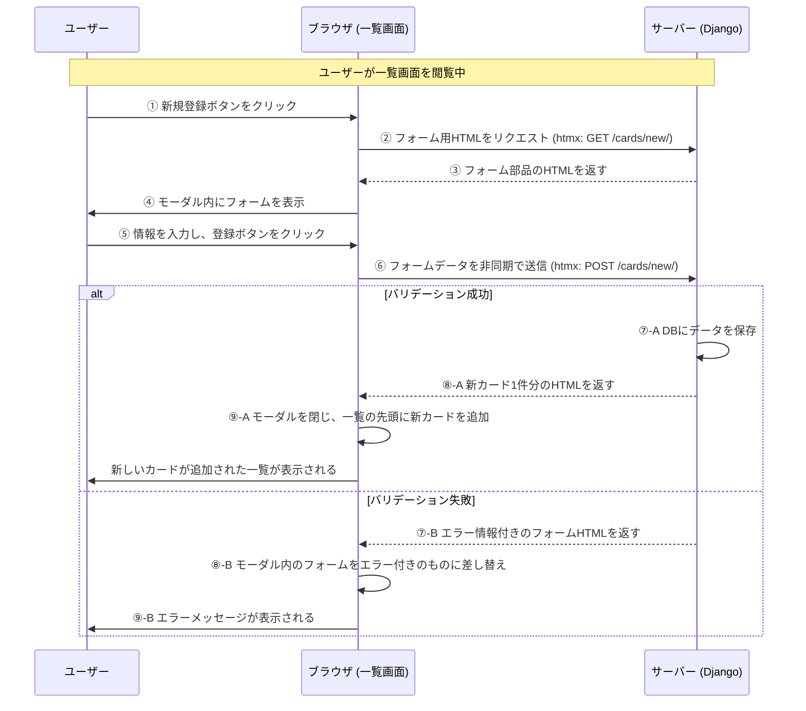
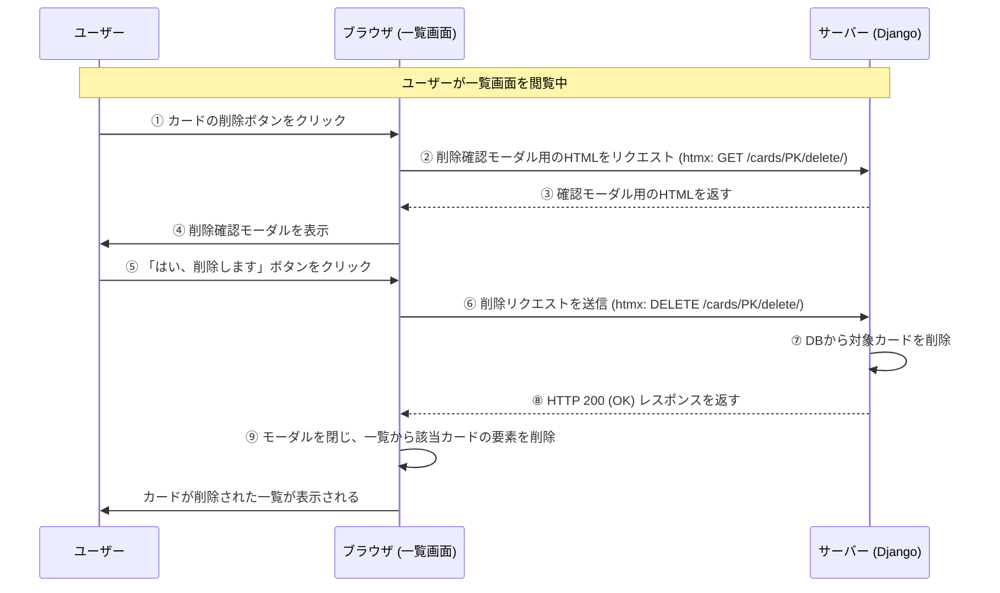

# 遷移図 (HTMX利用)

このドキュメントは、`htmx` を利用して画面遷移なしに操作を完結させる場合の画面フローを定義します。

## 新規登録フロー

一覧画面のボタンクリックからモーダルウィンドウ（ポップアップ）で新規カードを登録し、画面をリロードせずに一覧に反映されるまでの一連の流れです。

## 削除フロー

一覧画面の削除ボタンクリックから、確認モーダルを経て、対象のカードが画面上から削除されるまでの一連の流れです。

