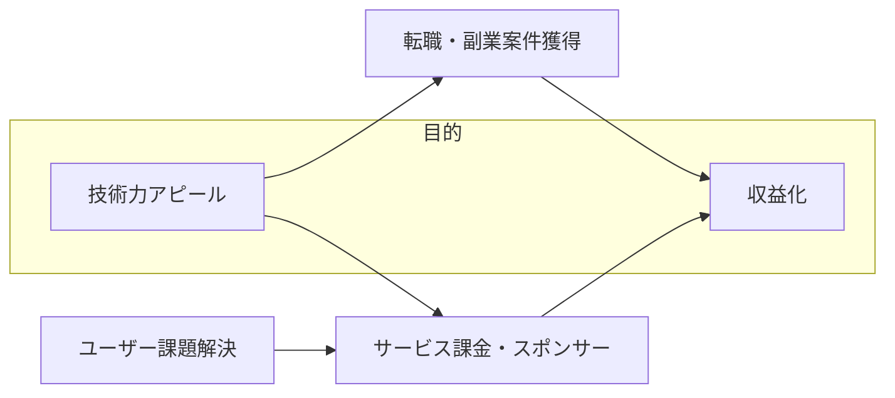
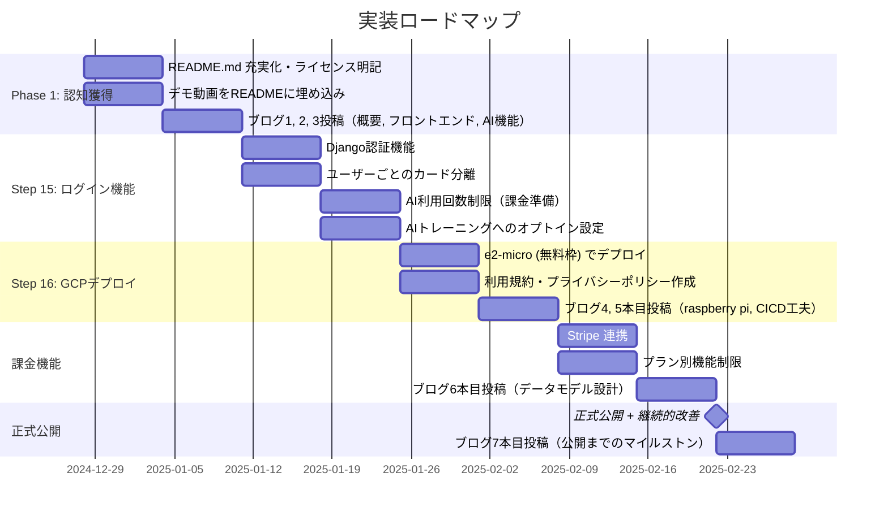

# マネタイズ戦略プラン

P TCG Home Gym Manager（ポケモンカード管理アプリ）の公開・収益化に向けた戦略ドキュメントです。

---

## 目次

- [マネタイズ戦略プラン](#マネタイズ戦略プラン)
  - [目次](#目次)
  - [1. エグゼクティブサマリー](#1-エグゼクティブサマリー)
  - [2. 主目的と方針決定](#2-主目的と方針決定)
    - [目的の整理](#目的の整理)
    - [決定事項](#決定事項)
  - [3. 市場評価](#3-市場評価)
  - [4. マネタイズ方針の比較](#4-マネタイズ方針の比較)
    - [4.1. 検討した5つの方針](#41-検討した5つの方針)
    - [4.2. 比較マトリクス](#42-比較マトリクス)
  - [5. 採用する戦略: ハイブリッドアプローチ](#5-採用する戦略-ハイブリッドアプローチ)
    - [5.1. Phase 1: 認知獲得](#51-phase-1-認知獲得)
    - [5.2. Phase 2: 収益化](#52-phase-2-収益化)
      - [課金プラン設計](#課金プラン設計)
  - [6. 法的・運用上の整備事項](#6-法的運用上の整備事項)
    - [6.1. 著作権対応](#61-著作権対応)
    - [6.2. AIトレーニングへのデータ利用](#62-aiトレーニングへのデータ利用)
    - [6.3. ライセンス選定](#63-ライセンス選定)
    - [6.4. 必要な法的ドキュメント](#64-必要な法的ドキュメント)
  - [7. 実装ロードマップ](#7-実装ロードマップ)
  - [8. 収益見込](#8-収益見込)
  - [9. 市場拡大のオプション](#9-市場拡大のオプション)

---

## 1. エグゼクティブサマリー

| 項目         | 内容                                                                                   |
| :----------- | :------------------------------------------------------------------------------------- |
| **主目的**   | 技術力アピール → 収益化へ繋げる                                                        |
| **採用戦略** | 技術ブログ連載 + OSS公開 + フリーミアムSaaS の3層ハイブリッド                          |
| **市場評価** | ポケカ市場は巨大。「管理アプリ × AI」セグメントは中規模ニッチ（競合少、参入余地あり）  |
| **収益目標** | 初期: 0〜5万円/月 → 成熟期: 月10万/月 → 英語対応後:30万円以上/月                       |
| **法的対応** | AGPL-3.0ライセンス、利用規約・プライバシーポリシー整備、AIトレーニングはオプトイン形式 |

---

## 2. 主目的と方針決定

### 目的の整理



### 決定事項

- **技術力アピールが主目的**だが、**収益につながらなければ意味がない**
- 両方を最大化する「ハイブリッド戦略」を採用
- 自己満足の技術力ではなく、**ユーザー(他人)の課題解決に貢献**し続けたい

---

## 3. 市場評価


**結論**: ポケモンカード市場自体は巨大だが、「プレイヤー向け在庫管理アプリ」というセグメントでは**競合が少なく参入余地がある**。

競合として販売・購入目的の管理サイト, 公式提供の図鑑サイトは存在するが、在庫管理目的としては、プレイヤーの多くがExcel/スプレッドシートで管理している状態。

---

## 4. マネタイズ方針の比較

### 4.1. 検討した5つの方針

| #    | 方針                 | 概要                                 | 収益見込          |
| :--- | :------------------- | :----------------------------------- | :---------------- |
| 1    | **フリーミアムSaaS** | GCPにデプロイ、基本無料 + 有料プラン | 月3〜5万円        |
| 2    | **OSSスポンサー**    | GitHub公開 + GitHub Sponsors         | 月0〜5千円        |
| 3    | **技術ブログ**       | Qiita/Zenn連載、ブランディング       | 月0〜1万円        |
| 4    | **企業導入支援**     | カードショップ向けカスタマイズ導入   | 1件50〜100万円    |
| 5    | **ライセンス販売**   | Dockerイメージの有料配布             | 月5万円（楽観的） |

### 4.2. 比較マトリクス

| 方針             | 初期コスト | 運用負荷 | 収益ポテンシャル | 技術力証明 | おすすめ度        |
| :--------------- | :--------- | :------- | :--------------- | :--------- | :---------------- |
| フリーミアムSaaS | 低〜中     | 高       | ⭐⭐⭐              | ⭐⭐         | ⭐⭐⭐⭐              |
| OSSスポンサー    | 低         | 中       | ⭐                | ⭐⭐⭐⭐       | ⭐⭐⭐               |
| 技術ブログ       | ゼロ       | 中       | ⭐                | ⭐⭐⭐⭐⭐      | ⭐⭐⭐⭐              |
| 企業導入支援     | 低         | 高       | ⭐⭐⭐⭐⭐            | ⭐⭐⭐        | ⭐（営業力次第）   |
| ライセンス販売   | 低         | 低       | ⭐⭐               | ⭐⭐         | ⭐(サポート負荷高) |

---

## 5. 採用する戦略: ハイブリッドアプローチ

### 5.1. Phase 1: 認知獲得

| 施策                 | 内容                         | 期待効果                                 |
| :------------------- | :--------------------------- | :--------------------------------------- |
| **技術ブログ連載**   | Qiita/Zenn で7本の記事を投稿 | エンジニアコミュニティでの認知、検索流入 |
| **GitHub OSS公開**   | README充実、デモ動画添付     | スター獲得、ポートフォリオ               |
| **X (Twitter) 発信** | 開発過程・学びの共有         | フォロワー獲得、ブログへの誘導           |

技術ブログの詳細構成は `docs/post/00_summary.md` を参照。

### 5.2. Phase 2: 収益化

| 施策                 | 内容                                 | 収益見込           |
| :------------------- | :----------------------------------- | :----------------- |
| **フリーミアムSaaS** | GCPにデプロイ、基本無料 + 有料プラン | 月10,000〜50,000円 |
| **GitHub Sponsors**  | 支援を受け付け                       | 月0〜5,000円       |
| **技術コンサル**     | 副業案件・技術相談                   | 案件次第           |

#### 課金プラン設計

| プラン       | 料金    | 制限                                  |
| :----------- | :------ | :------------------------------------ |
| **Free**     | ¥0      | カード登録上限: 100枚、AI解析: 5回/日 |
| **Standard** | ¥300/月 | カード登録: 500枚、AI解析: 30回/日    |
| **Pro**      | ¥500/月 | 無制限、CSV出力、優先サポート         |

---

## 6. 法的・運用上の整備事項

### 6.1. 著作権対応

| 観点                         | 評価             | 説明                                                                   |
| :--------------------------- | :--------------- | :--------------------------------------------------------------------- |
| ユーザーアップロード         | ✅ 問題なし       | メルカリ、ヤフオク等と同様。プラットフォームとして「場を提供」するだけ |
| 画像の他人への公開           | ✅ 問題なし       | ユーザー個人の資産管理用途。他人に公開しない                           |
| AIトレーニング利用           | ⚠️ オプトイン必須 | ユーザーの明示的同意が必要                                             |
| デモ画像・スクリーンショット | ⚠️ 注意           | READMEやブログで使う画像は自分のカードの画像に限定                     |

### 6.2. AIトレーニングへのデータ利用

ユーザーデータをAI精度改善に利用するため、以下の対応を行う。

1. **オプトイン設定**: ユーザー設定画面に「AI精度改善に協力する（デフォルト: OFF）」を設置
2. **利用規約に明記**: 「AIトレーニングへのデータ提供はオプトイン形式」
3. **プライバシーポリシー**: 「データは統計的に処理され、個人を特定しない形で利用」

```python
# 例: ユーザーモデルへの追加フィールド
class UserProfile(models.Model):
    user = models.OneToOneField(User, on_delete=models.CASCADE)
    allow_ai_training = models.BooleanField(default=False, verbose_name="AI精度改善への協力")
```

### 6.3. ライセンス選定

**採用ライセンス: AGPL-3.0**

| 観点     | AGPL-3.0 の特徴                                         |
| :------- | :------------------------------------------------------ |
| OSS公開  | ✅ コードを自由に公開・共有可能                          |
| 競合対策 | ✅ 改変して使う場合もOSS公開を要求（コピーキャット防止） |
| 商用利用 | ✅ 自分自身はクラウドサービスとして商用利用可能          |
| 企業導入 | ⚠️ AGPL を嫌う企業もあるため、デュアルライセンスも検討可 |

### 6.4. 必要な法的ドキュメント

| ドキュメント               | 内容                                                                 | 優先度 |
| :------------------------- | :------------------------------------------------------------------- | :----- |
| **README.md (ライセンス)** | AGPL-3.0 を明記                                                      | 必須   |
| **利用規約**               | ユーザーコンテンツの著作権帰属、AIトレーニングのオプトイン、免責事項 | 必須   |
| **プライバシーポリシー**   | データの取り扱い、Cookie、第三者提供の有無                           | 必須   |

---

## 7. 実装ロードマップ



---

## 8. 収益見込

| フェーズ             | 期間       | 月額収益見込       | 補足                             |
| :------------------- | :--------- | :----------------- | :------------------------------- |
| 初期（日本市場のみ） | 0〜6ヶ月   | ¥3,000〜50,000     | ユーザー獲得期間、課金転換率低め |
| 成長期               | 6〜12ヶ月  | ¥30,000〜100,000   | 認知拡大、リピーター獲得         |
| 成熟期（英語対応後） | 12ヶ月以降 | ¥100,000〜300,000+ | グローバル市場参入               |

**補足**: GitHub Sponsors、技術コンサル等の副次収入は含まず。

---

## 9. 市場拡大のオプション

現在は日本市場限定だが、以下の施策でTAM（Total Addressable Market）を大幅に拡大可能。

| 施策                           | 効果                                   | 優先度 |
| :----------------------------- | :------------------------------------- | :----- |
| **英語対応**                   | グローバル市場（日本の10倍以上）へ参入 | 高     |
| **他TCG対応（MTG, 遊戯王）**   | TAMの大幅拡大                          | 中     |
| **デッキ共有・ソーシャル機能** | 口コミ拡散、ネットワーク効果           | 中     |
